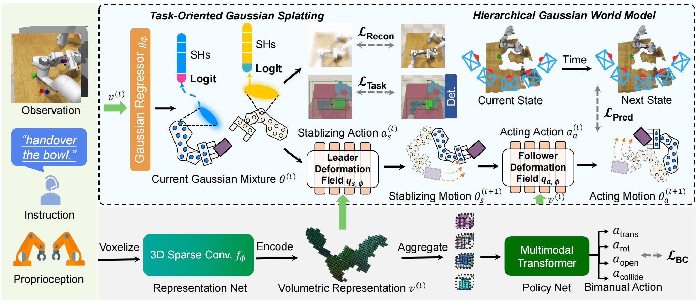

<div align="center">

# ManiGaussian++: General Robotic Bimanual Manipulation with Hierarchical Gaussian World Model

[](https://github.com/pre-commit/pre-commit)
[](https://pytorch.org/get-started/locally/)
[](https://wandb.ai/site/)
[](https://hydra.cc/)
[](https://github.com/ashleve/lightning-hydra-template#license)

[Tengbo Yu <sup>*</sup>](https://tengbo-yu.github.io/), 
[Guanxing Lu <sup>*</sup>](https://guanxinglu.github.io/),
[Zaijia Yang <sup>*</sup>](https://github.com/April-Yz), 
[Haoyuan Deng](https://github.com/Denghaoyuan123?tab=repositories), 
[Season Si Chen](https://www.sigs.tsinghua.edu.cn/Chensi_en/main.htm), 
[Jiwen Lu](https://scholar.google.com/citations?user=TN8uDQoAAAAJ&hl=en),
[Wenbo Ding](https://ssr-group.net/),
[Guoqiang Hu](https://scholar.google.com/citations?user=Iiq2HKYAAAAJ&hl=en),
[Yansong Tang <sup>†</sup>](https://andytang15.github.io/), 
[Ziwei Wang](https://ziweiwangthu.github.io/)

**[[arXiv](https://www.arxiv.org/abs/2506.19842)] | [[PDF](https://arxiv.org/pdf/2412.06779)]**
</div>

Multi-task robotic bimanual manipulation is becoming increasingly popular as it enables sophisticated tasks that require diverse dual-arm collaboration patterns. Compared to unimanual manipulation, bimanual tasks pose challenges to understanding the multi-body spatiotemporal dynamics. An existing method ManiGaussian pioneers encoding the spatiotemporal dynamics into the visual representation via Gaussian world model for single-arm settings, which ignores the interaction of multiple embodiments for dual-arm systems with significant performance drop. In this paper, we propose ManiGaussian++, an extension of ManiGaussian framework that improves multi-task bimanual manipulation by digesting multi-body scene dynamics through a hierarchical Gaussian world model. To be specific, we first generate task-oriented Gaussian Splatting from intermediate visual features, which aims to differentiate acting and stabilizing arms for multibody spatiotemporal dynamics modeling. We then build a hierarchical Gaussian world model with the leader-follower architecture, where the multi-body spatiotemporal dynamics is mined for intermediate visual representation via future scene prediction. The leader predicts Gaussian Splatting deformation caused by motions of the stabilizing arm, through which the follower generates the physical consequences resulted from the movement of the acting arm. As a result, our method significantly outperforms the current state-of-the-art bimanual manipulation techniques by an improvement of 20.2% in 10 simulated tasks, and achieves 60% success rate on average in 9 challenging real-world tasks.
<div align="center">


</div>

# 🎉 **NEWS**: 

- *Jun. 2025:* Codebase for simulated  experiments is released!
- *Jun. 2025:* Our paper is accepted by [IROS2025](https://www.iros25.org/)!

# 💻 Installation

**NOTE**: ManiGaussian++ is mainly built upon the [Perceiver-Actor^2](https://github.com/markusgrotz/peract_bimanual) repo by Markus Grotz et al.

See [INSTALL.md](docs/INSTALLATION.md) for installation instructions. 

<!-- See [ERROR_CATCH.md](docs/ERROR_CATCH.md) for error catching. -->

# 🛠️ Usage

The following steps are structured in order.

## 🗃️ Generate Demonstrations 
```
bash scripts/gen_demonstrations_nerf.sh
```

## 🚆 Training
We use wandb to log some curves and visualizations. Login to wandb before running the scripts.
```
wandb login
```

To train our ManiGaussian without deformation predictor, task-oriented Gaussian and hierarchical Gaussian world model
```
bash scripts/train_bimanual.sh ManiGaussian_BC2 0,1 12345 ${exp_name}
```

To train our ManiGaussian without task-oriented Gaussian and hierarchical Gaussian world, run:
```
bash scripts/train_bimanual_dyn.sh ManiGaussian_BC2 0,1 12345 ${exp_name}
```

To train our ManiGaussian without hierarchical Gaussian world, run:
```
bash scripts/train_LF_MASK_IN_NERF.sh ManiGaussian_BC2 0,1 12345 ${exp_name}
```

To train our vanilla ManiGaussian, run:
```
bash scripts/train_LF_MASK_IN_NERF_HIER.sh ManiGaussian_BC2 0,1 12345 ${exp_name}
```

### Evaluation
To evaluate the checkpoint, you can use:
```bash
bash scripts/eval.sh ManiGaussian_BC2 ${exp_name} 0
```

# 🏷️ License
This repository is released under the MIT license.

# 🙏 Acknowledgement

Our code is built upon [ManiGaussian](https://github.com/GuanxingLu/ManiGaussian), [AnyBimanual](https://github.com/Tengbo-Yu/AnyBimanual), [Perceiver-Actor^2](https://github.com/markusgrotz/peract_bimanual), [PerAct](https://github.com/peract/peract), [RLBench](https://github.com/stepjam/RLBench), and [CLIP](https://github.com/openai/CLIP). We thank all these authors for their nicely open sourced code and their great contributions to the community.

# 🔗 Citation
Coming Soon.
